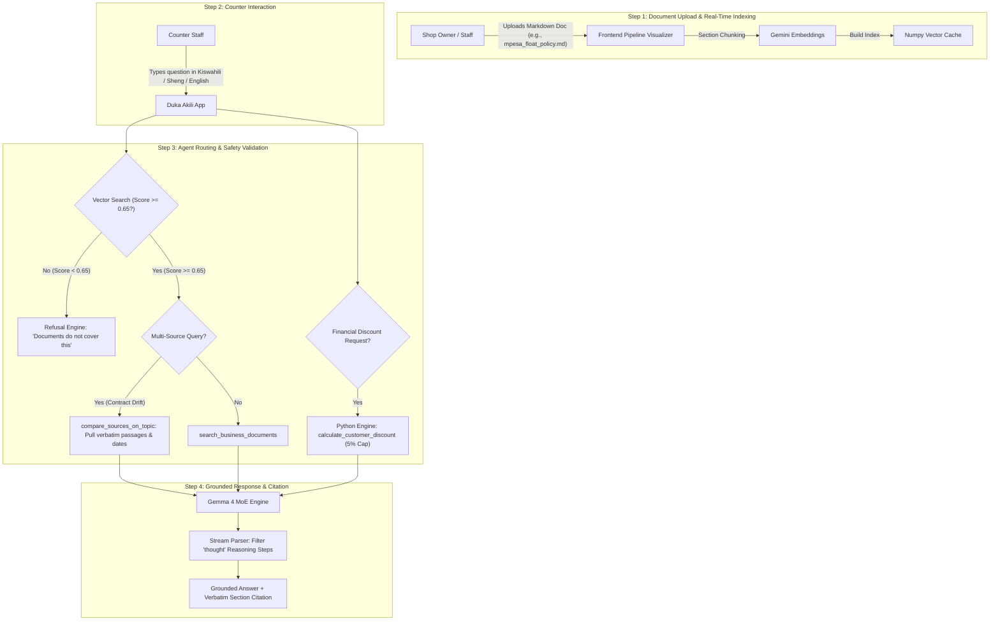
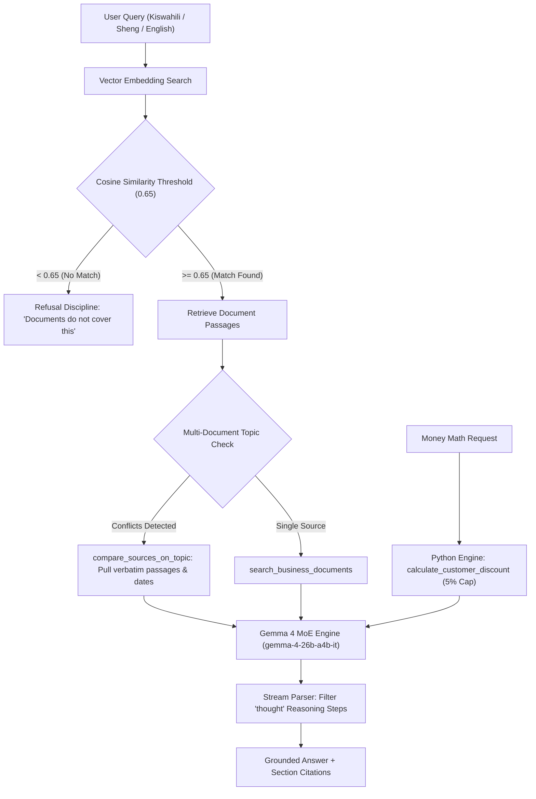

<!--
Kaggle Submission Writeup for Build with Gemma: GDG on Campus UoN
Track: Small Business & FinTech
Team: FinTech Team 2
Word Count Target: ~1,200 words (Limit: 1,500)
-->

# Duka Akili

### A shop's own records, made honest, searchable, and willing to surface their own contradictions across the counter — powered by Gemma 4.

**Track:** Small Business & FinTech  
**Team:** FinTech Team 2  
**Live Demo:** [duka-akili-web.run.app](https://duka-akili-web-354092327858.us-central1.run.app)  
**Code Repository:** [github.com/zackseal89/duka-akili](https://github.com/zackseal89/duka-akili)

**Team Members**

| Name | Focus |
|---|---|
| Githui Allan Karige | Data Science / ML / AI |
| Ian Kamau | Data Science / ML / AI |
| Zachary Ongeri | Product / Business |
| Alvin Ouma | Software / App Development |
| Mark Clinton | Software / App Development |

---

## 1. The Problem: Silent Document Drift Behind the Counter

A small retail shop (duka) in Kawangware, Nairobi runs on paper and institutional memory. Tucked in a drawer or pinned behind the counter is a supplier contract from Unga Millers, another from Coastal Beverages, a printed staff handbook from last year, a customer pricing policy, and a photocopied KRA turnover tax guide. 

When a customer brings back a damaged bale of flour, the attendant needs an immediate, definitive answer: *Do we accept this return?* 

The answer exists on paper, but in two different places that do not agree:
* Section 2 of the **Unga Millers Supplier Contract** mandates that damaged stock must be reported within **48 hours** with photo evidence.
* Section 4.2 of the **Staff Handbook** states that staff have **7 days** to process supplier returns.

Written seven months apart, neither document was updated when supplier terms were renegotiated. The attendant must either guess, spend ten minutes calling the shop owner, or refuse the customer. Each option costs real money. Multiply that by forgotten tier discount rules, tax filing deadlines, and high staff turnover that routinely wipes out tribal knowledge.

This is not a data availability problem—the shop already owns the information. It is a **retrieval, authority, and reconciliation problem**: critical terms are unreachable at the moment of decision, and when documents contradict each other, nothing surfaces the drift.

---

## 2. What We Built: Duka Akili

Duka Akili is an agentic business assistant built with the Google Agent Development Kit (ADK) and powered by `gemma-4-26b-a4b-it`. It answers staff questions directly from the shop's uploaded documents across five core operational behaviors:

### App User Flow Architecture

### Grounded Retrieval & Precise Section Citation
Every answer is grounded strictly in retrieved document passages. Rather than returning generic advice, every statement cites the specific source document and section (e.g., `supplier_contract_unga_millers.md, section 2: Returns and Damaged Stock`).

### Strict Refusal Discipline
In retail operations, an invented policy is far worse than no answer—a confident wrong refund rule costs shillings immediately, whereas a refusal costs a brief phone call. When retrieval yields no relevant context, Duka Akili explicitly refuses to guess and directs staff to consult the owner.

### Automated Cross-Document Contradiction Detection
This is the primary technical differentiator. When a query touches topics governed by multiple sources, the agent invokes `compare_sources_on_topic` to retrieve matching sections independently. If the sources conflict, Duka Akili does not quietly pick one or hallucinate a blend. Instead, it:
1. States clearly that the shop's own records disagree.
2. Quotes both passages verbatim alongside their effective dates.
3. Recommends following the newer, legally binding supplier contract for immediate operational safety.
4. Flags the older staff handbook as due for an immediate update.

### Deterministic Money Math & Hard Security Constraints
To eliminate financial hallucinations, all monetary logic runs in plain Python code rather than LLM token prediction. The `calculate_customer_discount` tool executes the shop's exact tier rules (walk-in, regular, wholesale, partner). Furthermore, security policy is enforced in code: **a manager discount override above 5% is hard-rejected by Python function logic, regardless of what the prompt or user requests.**

### Local Language Accessibility (Kiswahili & Sheng)
Counter interactions in Kenya happen fluidly in Kiswahili and Sheng. Duka Akili detects and responds naturally in the user's language while preserving precise English document citations and financial numbers.

---

## 3. Architecture, Tech Stack & Gemma 4 Dataflow Pipeline

### Technical Stack Summary
| Layer | Technology | Purpose |
|---|---|---|
| **AI Model** | `gemma-4-26b-a4b-it` (MoE) | Low-latency reasoning & tool calling across the counter |
| **Agent Framework** | Google Agent Development Kit (ADK) | Native agentic loop & tool orchestration |
| **Retrieval & Vector Search** | `gemini-embedding-001` + `numpy` | Lightweight section-level cosine similarity index |
| **Backend Service** | Python 3.11, FastAPI, `uv` | High-performance API server & deterministic math tools |
| **Deployment** | Google Cloud Run & Docker | Zero-setup, instant public evaluation endpoint |

### Why `gemma-4-26b-a4b-it` (Mixture-of-Experts)
An assistant used across a retail counter is strictly **latency-bound**. We selected the Mixture-of-Experts (MoE) variant `gemma-4-26b-a4b-it` over dense alternatives because its active 4B parameter routing delivers sub-second response times while maintaining large-model reasoning depth. This allows fluid function calling and multi-document comparison during live customer interactions.

### Engineering Gemma 4 Thinking Mode
Gemma 4 introduces native Thinking Mode capabilities. During streaming function-calling events, the model emits internal reasoning steps marked with a boolean `thought` field. We engineered custom filtering logic in both the client handler and frontend stream parser to separate internal thinking from visible user output, preventing reasoning narration leaks and suppressing duplicate tool execution replays.

### Empirical Refusal Thresholding
Retrieval runs via dot-product cosine similarity over section-level markdown embeddings. To make refusal mathematically reliable, we empirically benchmarked similarity scores across sample query sets:
* Clearly off-topic queries (e.g., weather, football) scored **0.55 – 0.60**.
* Genuine document matches scored **0.73 and above**.

We established a strict retrieval threshold at **0.65**—safely inside the measured margin. Passages below 0.65 are discarded before the LLM sees them, guaranteeing that refusal fires reliably whenever information is missing.

---

## 4. Engineering Learnings & Sprint Pivots

### The Vision Prototype Pivot
We deliberately abandoned our initial prototype. Our early sprint version used Gemma 4's vision capabilities to OCR and transcribe handwritten paper ledgers, achieving 96% field accuracy after tuning. However, we realized that "photograph a table to get a table back" solved a generic digitization problem rather than the shop's core bottleneck. With 36 hours remaining, we pivoted entirely to agentic RAG, cross-document reconciliation, and deterministic policy enforcement.

### Deployment & Container Architecture
While local embeddings using `EmbeddingGemma-300m` were planned for air-gapped deployment, Hugging Face and Kaggle require interactive license agreements that prevent non-interactive container builds. To ensure judges can evaluate a live, zero-setup deployment without authentication hurdles, we routed embeddings through the Gemini API while keeping vector indexing lightweight in pure `numpy` with zero vector database overhead.

---

## 5. Track Alignment & Strategic Roadmap

### Track: Small Business & FinTech
Duka Akili sits firmly in merchant operations and retail finance. Its tools directly govern supplier contract terms, inventory return workflows, tax compliance, and tiered discount execution.

### The Open-Weights Edge Advantage
For a small business, supplier contracts, gross margins, and staff records represent sensitive competitive data. Because Gemma 4 offers **open weights**, Duka Akili's architecture provides a clear path to **fully local, zero-cost edge execution**:
1. **Offline Continuity:** Running quantized Gemma 4 locally on consumer duka hardware ensures the assistant operates reliably during internet outages.
2. **Zero Variable Overhead:** Replaces monthly per-token API costs with predictable local hardware.
3. **Absolute Data Privacy:** Merchant financial records and contract terms never leave the shop.
4. **Role-Based Access Control (RBAC):** Extending hard code-enforced boundaries (like the 5% override cap) into role-based document access, ensuring cashiers, managers, and owners receive appropriately scoped capabilities.

---

## 6. Conclusion

Duka Akili demonstrates that AI in small business finance should not be an unconstrained chatbot. By combining Gemma 4's MoE reasoning with strict refusal thresholds, deterministic code boundaries, and automated conflict detection, Duka Akili turns messy duka paperwork into an honest, reliable partner at the counter.
